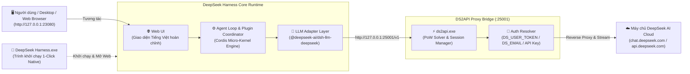

# DeepSeek Harness (Bản Tiếng Việt)

Tiếng Việt | [English](README.en.md) | [中文](README.zh.md)

**DeepSeek Harness (`dsh`)** là nền tảng Agent Harness mã nguồn mở thế hệ mới do **[DeepSeek AI](https://deepseek.com)** phát triển.

Hệ thống được thiết kế theo triết lý kiến trúc **"Mọi thứ đều là Plugin" (Everything is a Plugin)**, vận hành trên nền tảng **[Cordis](https://github.com/cordiverse/cordis)**. Phiên bản này đã được tối ưu hóa toàn diện với giao diện **Tiếng Việt 100%**, tích hợp cầu nối **`ds2api`** tự động, và hỗ trợ ứng dụng Desktop **`DeepSeek Harness.exe`** 1-Click cho Windows.

---

## 1. Sơ đồ Kiến trúc & Luồng hoạt động (Architecture Flowchart)



---

## 2. Các Tính Năng Nổi Bật

- **Tích hợp sẵn `ds2api` tự động 100%**:
  - Tự động biên dịch và khởi chạy `ds2api.exe` ngầm trong nền.
  - Tự động chuyển đổi tài khoản DeepSeek Web (`chat.deepseek.com`) sang chuẩn OpenAI API tương thích mà không cần phần mềm thứ 3.
  - Tự động dọn dẹp tiến trình an toàn khi tắt ứng dụng.

- **Hỗ trợ đầy đủ các Mô hình Thế hệ mới**:
  - `DeepSeek-V4-Flash` / `DeepSeek-V4-Flash-Search` (Tốc độ phản hồi tức thì).
  - `DeepSeek-V4-Pro` / `DeepSeek-V4-Pro-Search` (Tư duy suy luận sâu - Deep Thinking Stream).
  - `DeepSeek-V4-Vision` (Xử lý hình ảnh và dữ liệu thị giác).

- **Cổng kết nối chuyên dụng (Tránh xung đột cổng mạng)**:
  - **Cổng Web UI**: `http://127.0.0.1:23080` (Thay thế cổng mặc định 3080 để tránh đụng độ các dịch vụ dev).
  - **Cổng DS2API Proxy**: `http://127.0.0.1:25001` (Thay thế cổng mặc định 5001).

- **Desktop App `DeepSeek Harness.exe`**:
  - Được đóng gói bản địa (Native Windows Executable) kèm biểu tượng **Logo cá voi DeepSeek** chính thức.
  - Khởi động 1 chạm: Click đúp vào file `.exe` sẽ tự chạy toàn bộ backend ngầm và tự động bật trình duyệt web.

- **Việt hóa Toàn diện (100% Vietnamese Localization)**:
  - Toàn bộ 24 package Client, Menu, Cài đặt, Thanh bên (Sidebar), Trình quản lý Phiên (Session), Công cụ (Tools), Kế hoạch (Plan Mode), Mục tiêu (Goal Tracking) và Quỹ đạo thực thi (Trajectory) đều hiển thị tiếng Việt chuẩn xác.

---

## 3. Cấu hình Biến môi trường (`.env`)

Mở file `.env` tại thư mục gốc của dự án để tùy chỉnh phương thức kết nối:

### Lựa chọn A: Sử dụng tài khoản Web DeepSeek miễn phí (qua `ds2api`)
```env
# Kích hoạt chế độ tự động chạy ds2api
DS2API_ENABLED=true

# Cách 1: Điền token lấy từ tab Network trên chat.deepseek.com
DS_USER_TOKEN=your_user_token_here

# Hoặc Cách 2: Điền Email và Mật khẩu tài khoản DeepSeek
# DS_EMAIL=your_email@example.com
# DS_PASSWORD=your_password
```

### Lựa chọn B: Sử dụng Official API Key của DeepSeek
```env
DEEPSEEK_API_KEY=sk-your-official-deepseek-api-key
# DEEPSEEK_BASE_URL=https://api.deepseek.com
```

---

## 4. Hướng dẫn Khởi chạy

### Cách 1: Sử dụng Desktop App (Khuyên dùng trên Windows)
Chỉ cần **click đúp vào file `DeepSeek Harness.exe`** tại thư mục gốc. Ứng dụng sẽ tự động khởi động các tiến trình con và tự mở trình duyệt web tại `http://127.0.0.1:23080`.

---

### Cách 2: Chạy từ Terminal / Dòng lệnh
Nếu muốn chạy từ dòng lệnh:

```powershell
# Chạy trực tiếp Web UI
pnpm dsh web

# Hoặc chỉ định cổng tùy chỉnh
pnpm dsh web --port 23080
```

---

### Cách 3: Biên dịch từ mã nguồn (Build from source)
```powershell
# Cài đặt các gói phụ thuộc
pnpm install

# Biên dịch toàn bộ thư viện & Web UI
pnpm run build

# Biên dịch ứng dụng Desktop
cd tools/launcher
go build -o "../../DeepSeek Harness.exe" .
cd ../..
```

---

## 5. Bảng Cổng Mạng (Network Ports)

| Thành phần | Cổng mặc định | Địa chỉ truy cập | Ghi chú |
| :--- | :---: | :--- | :--- |
| **Web UI Dashboard** | `23080` | `http://127.0.0.1:23080` | Giao diện điều khiển Agent tiếng Việt |
| **DS2API Bridge** | `25001` | `http://127.0.0.1:25001/v1` | Cầu nối API cho các model DeepSeek |

---

## 6. Cấu trúc Dự án

```
deepseek-harness/
├── DeepSeek Harness.exe      # Ứng dụng Desktop Windows 1-Click (kèm Logo Icon)
├── .env                      # File cấu hình biến môi trường & API Key
├── apps/
│   └── cli/                  # Trình dòng lệnh dsh CLI & Runner quản lý vòng đời
├── packages/
│   ├── client/               # 24 gói giao diện Web UI & Đa ngôn ngữ (Tiếng Việt)
│   ├── core/                 # Nhân điều khiển Agent, Session, Plugin, Tools
│   └── llm/                  # Các Adapter kết nối mô hình (DeepSeek, Pi AI,...)
├── tools/
│   ├── ds2api/               # Mã nguồn Go & binary ds2api.exe (Cầu nối Web -> API)
│   └── launcher/             # Mã nguồn Go & Icon resource của DeepSeek Harness.exe
└── website/                  # Trang tài liệu & dự án
```

---

## 7. Giấy phép & Bản quyền (License)

Dự án được phân phối theo giấy phép [MIT](LICENSE).
Các thông báo bản quyền của bên thứ ba được ghi nhận tại [THIRD_PARTY_NOTICES.md](THIRD_PARTY_NOTICES.md).
