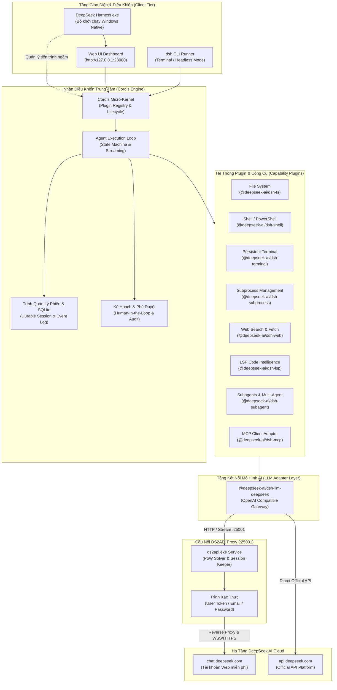

# DeepSeek Harness (Bản Tiếng Việt & Cầu Nối DS2API)

Tiếng Việt | [English](README.en.md) | [中文](README.zh.md)

**DeepSeek Harness (`dsh`)** là nền tảng Agent Harness thế hệ mới mã nguồn mở, được xây dựng dựa trên kiến trúc vi nhân (Micro-kernel) của **Cordis** với triết lý thiết kế cốt lõi: **"Mọi thứ đều là Plugin" (Everything is a Plugin)**.

Dự án này là phiên bản mở rộng toàn diện, được Việt hóa 100% giao diện người dùng, tích hợp sẵn cầu nối **`ds2api`** tự động (chuyển đổi tài khoản DeepSeek Web sang chuẩn OpenAI API với PoW Solver nội bộ), đi kèm ứng dụng Desktop Windows Native 1-Click (`DeepSeek Harness.exe`).

---

## Bản Quyền & Giấy Phép

Copyright (c) 2024-2026 Nguyễn Quang Tú (QTusdev) - [https://github.com/qtu11/DeepSeek-Harness-Ds2api](https://github.com/qtu11/DeepSeek-Harness-Ds2api)

Nguyễn Quang Tú biên dịch lại

Dự án được phân phối theo giấy phép [MIT](LICENSE). Thông báo bản quyền của các thành phần bên thứ ba được ghi nhận tại [THIRD_PARTY_NOTICES.md](THIRD_PARTY_NOTICES.md).

---

## 1. Sơ Đồ Kiến Trúc Hệ Thống (System Architecture)

Hệ thống hoạt động theo mô hình phân lớp module hóa cao độ, đảm bảo tính mở rộng, bảo mật và khả năng cô lập tiến trình:



---

## 2. Các Tính Năng Nổi Bật

### 2.1. Tích Hợp Cầu Nối DS2API Tự Động 100%
- Tự động phát hiện, biên dịch và điều phối tiến trình `ds2api.exe` chạy ngầm.
- Giải toán Proof-of-Work (PoW) trực tiếp bằng engine tối ưu hóa viết bằng Go, không gây nghẽn CPU.
- Cho phép sử dụng tài khoản DeepSeek Web (`chat.deepseek.com`) dưới dạng chuẩn OpenAI API mà không cần đăng ký thẻ tín dụng hay trả phí API chính thức.
- Tự động duy trì phiên đăng nhập, làm mới token và tự dọn dẹp an toàn khi đóng ứng dụng.

### 2.2. Hỗ Trợ Đầy Đủ Các Dòng Mô Hình AI Thế Hệ Mới
- **DeepSeek-V4-Flash / DeepSeek-V4-Flash-Search**: Tốc độ phản hồi cực nhanh, tối ưu hóa cho tác vụ xử lý văn bản, tóm tắt và sinh mã thông thường.
- **DeepSeek-V4-Pro / DeepSeek-V4-Pro-Search**: Hỗ trợ chuỗi tư duy suy luận sâu (Deep Thinking / Chain-of-Thought Stream), phân tích logic phức tạp và giải quyết lỗi hệ thống.
- **DeepSeek-V4-Vision**: Tiếp nhận và phân tích dữ liệu hình ảnh, sơ đồ kiến trúc và giao diện người dùng.
- **DeepSeek Coder / DeepSeek Chat**: Đáp ứng chính xác các ngữ cảnh lập trình chuyên sâu.

### 2.3. Trình Khởi Chạy Desktop Native 1-Click (`DeepSeek Harness.exe`)
- Ứng dụng Desktop Windows đóng gói nhị phân độc lập, tích hợp logo cá voi DeepSeek bản quyền.
- Cơ chế **1-Click**: Khởi động đồng thời Web UI, Agent Backend và DS2API Bridge, sau đó tự động điều hướng trình duyệt hoặc mở cửa sổ giao diện mà không cần gõ lệnh.
- Quản lý đơn phiên (Single Instance Lock) chống trùng lặp tiến trình.

### 2.4. Việt Hóa Toàn Diện 100% (Full Vietnamese Localization)
- Toàn bộ 24 gói giao diện người dùng (Client packages) bao gồm: Menu điều hướng, Cài đặt hệ thống, Bảng điều khiển phiên làm việc (Session Dashboard), Trình theo dõi quỹ đạo thực thi (Trajectory Tracker), Chế độ lập kế hoạch (Plan Mode), Bảng kiểm duyệt an toàn (Safety Approvals) và Công cụ quản lý mục tiêu (Goal Tracking) đều được bản địa hóa sang Tiếng Việt chuẩn xác và mạch lạc.

### 2.5. Cơ Chế Cô Lập Cổng Mạng (Port Isolation)
- Tránh hoàn toàn tình trạng xung đột cổng với các dịch vụ phát triển khác (như Vite, Next.js, Docker):
  - **Cổng Web UI**: `http://127.0.0.1:23080` (thay cho cổng 3080).
  - **Cổng DS2API Proxy**: `http://127.0.0.1:25001` (thay cho cổng 5001).

### 2.6. Hệ Sinh Thái Công Cụ Toàn Năng (Advanced Tooling)
- Thao tác tệp tin đa năng (`read`, `write`, `replace_content`, `patch`).
- Thực thi dòng lệnh PowerShell/Bash liên tục (Persistent Shell Sessions).
- Tích hợp Language Server Protocol (LSP) để chẩn đoán lỗi cú pháp trực tiếp theo thời gian thực.
- Hỗ trợ giao thức MCP (Model Context Protocol) mở rộng kết nối với các công cụ ngoài.
- Điều phối Multi-Agent (Subagents Swarm) phân chia tác vụ song song.

---

## 3. Bảng Thông Số Cổng Mạng (Network Configuration)

| Thành Phần | Cổng Mặc Định | Địa Chỉ Truy Cập | Mục Đích Sử Dụng |
| :--- | :---: | :--- | :--- |
| **Web UI Dashboard** | `23080` | `http://127.0.0.1:23080` | Giao diện tương tác và quản lý Agent |
| **DS2API Proxy Bridge** | `25001` | `http://127.0.0.1:25001/v1` | Cầu nối API tương thích OpenAI cho DeepSeek |
| **RPC Gateway (Typert)** | Động / Nội bộ | `IPC / Loopback` | Giao tiếp loại hình an toàn giữa Host và Client |

---

## 4. Cấu Hình Biến Môi Trường (`.env`)

Tạo hoặc chỉnh sửa tệp `.env` tại thư mục gốc của dự án:

```env
# ==============================================================================
# CẤU HÌNH KẾT NỐI DEEPSEEK HARNESS
# ==============================================================================

# Cổng Web UI (Mặc định: 23080)
PORT=23080

# ------------------------------------------------------------------------------
# LỰA CHỌN A: SỬ DỤNG TÀI KHOẢN WEB DEEPSEEK MIỄN PHÍ (QUA DS2API)
# ------------------------------------------------------------------------------
DS2API_ENABLED=true
DS2API_PORT=25001

# Cách 1: Sử dụng User Token lấy từ chat.deepseek.com (Khuyên dùng)
# (Đăng nhập chat.deepseek.com -> F12 -> Application -> Local Storage -> userToken)
DS_USER_TOKEN=your_user_token_here

# Hoặc Cách 2: Đăng nhập bằng Email và Mật khẩu
# DS_EMAIL=your_email@example.com
# DS_PASSWORD=your_password_here

# ------------------------------------------------------------------------------
# LỰA CHỌN B: SỬ DỤNG OFFICIAL API KEY (NỀN TẢNG TRẢ PHÍ DEEPSEEK)
# ------------------------------------------------------------------------------
# DEEPSEEK_API_KEY=sk-your-official-deepseek-api-key
# DEEPSEEK_BASE_URL=https://api.deepseek.com
```

---

## 5. Hướng Dẫn Khởi Chạy

### Cách 1: Khởi Chạy Nhanh Bằng Ứng Dụng Desktop (Windows)
1. Mở thư mục dự án trên Windows Explorer.
2. Nhấp đúp chuột vào tệp `DeepSeek Harness.exe`.
3. Ứng dụng sẽ tự động kích hoạt backend, cầu nối `ds2api` và mở giao diện Web tại `http://127.0.0.1:23080`.

---

### Cách 2: Khởi Chạy Bằng Dòng Lệnh (CLI / Web Mode)
Yêu cầu Node.js >= 22.19 và pnpm >= 11.

```powershell
# 1. Cài đặt các gói phụ thuộc (chỉ chạy lần đầu)
pnpm install

# 2. Khởi chạy Web UI Dashboard
pnpm dsh web

# Hoặc chỉ định cổng tùy chọn
pnpm dsh web --port 23080
```

---

### Cách 3: Chạy Agent Trực Tiếp Trong Terminal (Headless / Interactive CLI)

```powershell
# Chạy tương tác với Profile lập trình chuyên sâu (Code Preset)
pnpm dsh --profile code

# Chạy một tác vụ tự động duy nhất (Headless Task)
pnpm dsh --profile headless "Phân tích cấu trúc thư mục packages/ và viết báo cáo tóm tắt"
```

---

### Cách 4: Tự Biên Dịch Lại Toàn Bộ Từ Mã Nguồn (Build From Source)

```powershell
# 1. Cài đặt toàn bộ dependencies trong monorepo
pnpm install

# 2. Biên dịch toàn bộ thư viện lõi và Web Frontend
pnpm run build

# 3. Biên dịch lại binary DS2API (Go)
cd tools/ds2api
go build -o ds2api.exe ./cmd/ds2api
cd ../..

# 4. Biên dịch lại Trình khởi chạy Desktop (Go + Windows Resources)
cd tools/launcher
go build -o "../../DeepSeek Harness.exe" .
cd ../..
```

---

## 6. Các Cấu Hình Agent Presets (Profiles)

Dự án cung cấp sẵn các cấu hình Agent tùy biến linh hoạt tại thư mục `apps/cli/config/agent-presets/`:

| Preset Profile | Mục Đích Sử Dụng | Các Plugin & Công Cụ Kích Hoạt |
| :--- | :--- | :--- |
| **`code`** | Lập trình phần mềm, sửa lỗi và tái cấu trúc | `dsh-fs`, `dsh-shell`, `dsh-terminal`, `dsh-lsp`, `dsh-subagent`, `dsh-plan` |
| **`minimal`** | Phản hồi văn bản thuần túy, tốc độ cao | `dsh-llm-deepseek`, giao diện tương tác cơ bản |
| **`standard`** | Sử dụng hàng ngày, đa năng | Web Search, Quản lý tệp tin, Quản lý phiên, Nén ngữ cảnh |
| **`cordis`** | Kiểm thử và phát triển các plugin mở rộng | Toàn bộ hệ sinh thái Cordis micro-kernel |
| **`headless`** | Tự động hóa tác vụ CI/CD và Script ngầm | Thực thi tự trị, không yêu cầu can thiệp giao diện |

---

## 7. Cấu Trúc Thư Mục Dự Án (Repository Structure)

```
DeepSeek-Harness-Ds2api/
├── DeepSeek Harness.exe      # Ứng dụng Desktop Windows 1-Click
├── .env                      # File cấu hình biến môi trường & khóa xác thực
├── package.json              # Quản lý kịch bản npm và cấu hình Monorepo
├── pnpm-workspace.yaml       # Khai báo không gian làm việc Monorepo
│
├── apps/                     # Các ứng dụng đầu cuối
│   ├── cli/                  # Bộ điều khiển dòng lệnh dsh CLI & Runner
│   └── desktop/              # Cấu hình Electron wrapper cho Desktop App
│
├── packages/                 # Hệ sinh thái các thư viện lõi (Plugin Packages)
│   ├── core/                 # Vòng lặp Agent Loop, Session, Tool Registry
│   ├── client/               # 24 gói giao diện Web UI (Đã Việt hóa 100%)
│   ├── llm/                  # Adapter kết nối mô hình DeepSeek & OpenAI
│   ├── fs/                   # Plugin quản lý và thao tác hệ thống tệp tin
│   ├── shell/                # Plugin điều khiển dòng lệnh PowerShell/Bash
│   ├── terminal/             # Plugin phiên Terminal liên tục
│   ├── subprocess/           # Plugin quản lý cây tiến trình con
│   ├── web/                  # Plugin tìm kiếm và trích xuất nội dung Web
│   ├── lsp/                  # Plugin Language Server Protocol
│   ├── subagent/             # Plugin phân quyền và điều phối Multi-Agent
│   ├── plan/                 # Plugin lập kế hoạch và quản lý trạng thái
│   ├── todo/                 # Plugin quản lý danh sách đầu việc
│   ├── compaction/           # Plugin nén ngữ cảnh tự động
│   └── typert/               # Hệ thống sinh đồ thị kiểu và RPC Gateway
│
├── tools/                    # Các công cụ hỗ trợ mở rộng
│   ├── ds2api/               # Mã nguồn Go & binary ds2api.exe (Web to API Bridge)
│   ├── launcher/             # Mã nguồn Go & tài nguyên Icon của DeepSeek Harness.exe
│   └── memos/                # Plugin bộ nhớ dài hạn Memos
│
├── docs/                     # Tài liệu kỹ thuật kiến trúc chi tiết
└── website/                  # Mã nguồn trang tài liệu VitePress
```

---

## 8. Lệnh Phát Triển & Kiểm Thử Dành Cho Lập Trình Viên

| Lệnh Thực Thi | Mô Tả Chức Năng |
| :--- | :--- |
| `pnpm install` | Cài đặt toàn bộ dependencies cho tất cả packages |
| `pnpm run build` | Biên dịch toàn bộ thư viện TypeScript và Web UI |
| `pnpm run test` | Chạy bộ kiểm thử đơn vị (Unit Tests với Vitest) |
| `pnpm run test:coverage` | Kiểm tra tỷ lệ bao phủ mã nguồn (Coverage Gate 100%) |
| `pnpm run test:e2e` | Chạy kiểm thử tích hợp thực tế với API |
| `pnpm run test:snapshot` | Kiểm tra tính toàn vẹn đầu ra với bản ghi snapshot |
| `pnpm run typecheck` | Kiểm tra tính nhất quán kiểu dữ liệu TypeScript |
| `pnpm run lint` | Rà quét lỗi phong cách viết mã với Oxlint |
| `pnpm run clean` | Dọn dẹp các tệp build tạm và artifact thừa |

---

## 9. Hướng Dẫn Đóng Góp (Contributing)

Mọi đóng góp nhằm nâng cao hiệu năng, cải tiến công cụ hoặc mở rộng tài liệu đều được hoan nghênh:
1. Fork dự án về tài khoản cá nhân.
2. Tạo nhánh mới (`git checkout -b feature/tinh-nang-moi`).
3. Thực hiện thay đổi và đảm bảo toàn bộ kiểm thử hợp lệ (`pnpm run typecheck && pnpm run test`).
4. Commit thay đổi (`git commit -m 'feat: them tinh nang moi'`).
5. Đẩy nhánh lên repository (`git push origin feature/tinh-nang-moi`).
6. Mở Pull Request để được duyệt và tích hợp.

---

## 10. Thông Tin Liên Hệ & Tác Quyền

- **Tác giả & Đơn vị biên dịch**: Nguyễn Quang Tú (QTusdev)
- **Repository chính thức**: [https://github.com/qtu11/DeepSeek-Harness-Ds2api](https://github.com/qtu11/DeepSeek-Harness-Ds2api)
- **Tài liệu tham khảo**: Thư mục [docs/](docs/)
