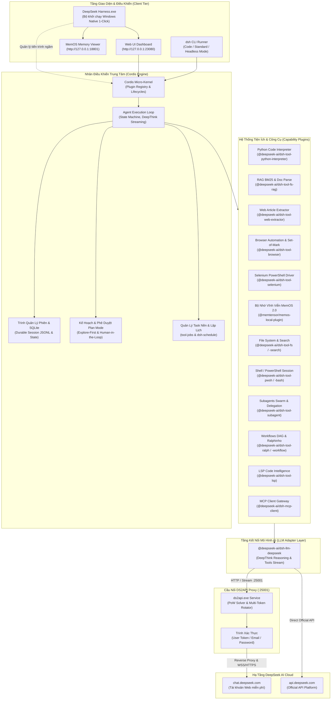

# DeepSeek Harness v1.0.3 (Bản Tiếng Việt & Cầu Nối DS2API)

Tiếng Việt | [English](README.en.md) | [中文](README.zh.md)

**DeepSeek Harness (`dsh`)** là nền tảng Autonomous AI Agent thế hệ mới mã nguồn mở, được xây dựng dựa trên kiến trúc vi nhân (Micro-kernel) của **Cordis** với triết lý thiết kế cốt lõi: **"Mọi thứ đều là Plugin" (Everything is a Plugin)**.

Phiên bản **v1.0.3** là bản cập nhật đột phá toàn diện, biến DeepSeek thành một Siêu Trợ Lý AI (Super Agent) tích hợp đầy đủ khả năng: **Bộ nhớ dài hạn vĩnh viễn từng project (MemOS 2.0 + RAG BM25), chuỗi suy luận sâu DeepThink (CoT stream), Trình thông dịch Python Code Interpreter, Bóc tách nội dung Web ngữ nghĩa, Tự động hóa trình duyệt với cơ chế thị giác Set-of-Mark, Điều khiển Selenium PowerShell native, Điều phối Multi-Agent/Subagents, Lập kế hoạch Plan Mode, Quy trình Workflows DAG, và Cầu nối DS2API tự động 100% kèm ứng dụng Desktop Windows Native 1-Click (`DeepSeek Harness.exe`)**.

---

## Bản Quyền & Giấy Phép

Copyright (c) 2024-2026 Nguyễn Quang Tú (QTusdev) - [https://github.com/qtu11/DeepSeek-Harness-Ds2api](https://github.com/qtu11/DeepSeek-Harness-Ds2api)

Nguyễn Quang Tú biên dịch và phát triển mở rộng.

Dự án được phân phối theo giấy phép [MIT](LICENSE). Thông báo bản quyền của các thành phần bên thứ ba được ghi nhận tại [THIRD_PARTY_NOTICES.md](THIRD_PARTY_NOTICES.md).

---

## 1. Sơ Đồ Kiến Trúc Hệ Thống (System Architecture v1.0.3)



---

## 2. Các Năng Lực & Tiện Ích Đột Phá Trong Phiên Bản v1.0.3

### 2.1. Bộ Nhớ Dài Hạn Vĩnh Viễn Từng Project (MemOS 2.0 & RAG BM25)
- **MemOS 2.0 Local Engine**: Tích hợp tầng bộ nhớ lâu dài đa lớp (L1/L2/L3), tự động thu thập tri thức quan trọng từ các cuộc hội thoại (Capture), tự động gợi ý ngữ cảnh phù hợp (Recall) cho từng dự án, hỗ trợ giao diện quản lý trực quan qua **MemOS Web Viewer** trên cổng `18801`.
- **RAG BM25 & Document Intelligence (`@deepseek-ai/dsh-tool-fs-rag`)**:
  - `rag_search`: Truy hồi ngữ nghĩa văn bản và mã nguồn theo thuật toán xếp hạng BM25 (Robertson-Spärck Jones IDF), phân tích chính xác đoạn mã hoặc tài liệu liên quan mà không gây tràn cửa sổ ngữ cảnh (Context Window).
  - `doc_parse`: Phân đoạn (chunking) thông minh theo cấu trúc dòng và vùng đệm (overlap buffer) cho các tài liệu lớn.
- **Session Persistence JSONL**: Ghi nhận toàn bộ luồng sự kiện theo chuẩn version 0, đảm bảo khôi phục trạng thái làm việc an toàn 100% khi khởi động lại.

### 2.2. Chuỗi Suy Luận Sâu DeepThink (Reasoning / CoT Streaming)
- Tự động bóc tách luồng dữ liệu suy luận `reasoning_content` delta từ DeepSeek R1/V3 thành khối tư duy logic (`reasoning block`) độc lập với khối nội dung trả lời (`text block`) và khối gọi công cụ (`tool-call`).
- Hỗ trợ đầy đủ các mức độ điều chỉnh nỗ lực suy luận (`Reasoning Effort`): `off`, `low`, `high`, `max`.

### 2.3. Trình Thông Dịch Python Code Interpreter (`@deepseek-ai/dsh-tool-python-interpreter`)
- Công cụ `python_execute`: Cho phép DeepSeek thực thi trực tiếp mã Python cục bộ trong môi trường an toàn có kiểm soát thời gian chờ (Timeout).
- Hỗ trợ giải toán, tính toán khoa học, phân tích cấu trúc dữ liệu với `pandas`/`numpy`, mô phỏng thuật toán và tự động xuất các tệp tin kết quả/hình ảnh đồ thị.

### 2.4. Bóc Tách Nội Dung Web Ngữ Nghĩa (`@deepseek-ai/dsh-tool-web-extractor`)
- Công cụ `web_extract`: Tự động tải bất kỳ đường dẫn URL/website nào, loại bỏ hoàn toàn các thành phần rác (quảng cáo, scripts, css, thanh điều hướng, footer) và chuyển đổi nội dung bài viết chính thành định dạng Markdown chuẩn sạch.

### 2.5. Tự Động Hóa Trình Duyệt & Phân Tích Thị Giác Set-of-Mark (`@deepseek-ai/dsh-tool-browser`)
- Điều khiển Chrome/Edge trực tiếp qua Playwright:
  - `browser_navigate`: Mở trang web và kiểm tra tiêu đề/mã phản hồi HTTP.
  - `browser_click`: Tương tác nhấn chuột theo CSS Selector, văn bản hiển thị hoặc tọa độ (X, Y).
  - `browser_type`: Nhập dữ liệu biểu mẫu, tự động xóa trường cũ và tùy chọn nhấn phím Enter.
  - `browser_screenshot`: Chụp ảnh màn hình toàn trang hoặc viewport để kiểm tra giao diện trực quan.
  - `browser_content` & `browser_eval`: Trích xuất DOM text/HTML và thực thi mã JavaScript trực tiếp trên trang.
- **Set-of-Mark Visual Numbering (`browser_highlight`)**: Tự động quét và gắn thẻ số `[1]`, `[2]`, `[3]` trực quan lên toàn bộ các nút bấm, liên kết và trường nhập liệu trên màn hình, hỗ trợ mô hình Vision AI nhận diện và thao tác chuẩn xác.

### 2.6. Điều Khiển Selenium Native Windows PowerShell (`@deepseek-ai/dsh-tool-selenium`)
- Công cụ `selenium_execute`: Chạy các kịch bản tự động hóa trình duyệt thông qua module Selenium PowerShell (`tools/selenium-powershell/Selenium.psd1`), hỗ trợ trọn bộ cmdlets `Start-SeDriver`, `Enter-SeUrl`, `Find-SeElement`, `Invoke-SeClick`, `Send-SeKeys`, `Get-SeScreenshot`, `Stop-SeDriver`.

### 2.7. Quản Lý Task Nền, Lập Lịch & Workflows Đa Tác Nhân (DAG)
- **Quản lý Task nền (`tool-jobs`)**: DeepSeek có thể chạy ngầm các lệnh dài hạn, theo dõi tiến độ, gửi dữ liệu stdin (`send_input`) và hủy tiến trình an toàn (`kill`).
- **Lập lịch tự động (`dsh-schedule`)**: Hỗ trợ hẹn giờ một lần (Timer) và lập lịch định kỳ (Cron expressions).
- **Điều phối Multi-Agent (`tool-subagent`, `subagent_fork`, `tool-subagent-control`)**: Khởi tạo mạng lưới agent con làm việc song song, phân nhánh ngữ cảnh và tổng hợp kết quả.
- **Pipeline Workflows (`tool-ralph`, `tool-workflow`)**: Thực thi quy trình làm việc theo đồ thị có hướng (DAG) trên worker threads độc lập với các cổng kiểm duyệt chất lượng nghiêm ngặt.

### 2.8. Chế Độ Lập Kế Hoạch Chuyên Sâu (Plan Mode)
- Cơ chế cách ly (Isolated Realm): Ép buộc agent thực hiện khảo sát toàn bộ codebase bằng các công cụ chỉ đọc (read-only) trước khi đưa ra kế hoạch thực thi chi tiết.
- Chuyển giao tự động qua `exit_plan_mode` để người dùng phê duyệt trước khi bắt đầu ghi file hay thay đổi hệ thống.

### 2.9. Đồ Thị Tri Thức Codebase & Bộ Nhớ Bài Học Work Memory (`@deepseek-ai/dsh-tool-fs-graphify`)
- **Knowledge Graph AST (`graphify_scan`, `graphify_query`)**: Quét toàn bộ codebase (đa ngôn ngữ: TypeScript, JavaScript, Python, Go, Rust, C#, SQL, JSON/YAML), trích xuất hơn 29,000+ nodes (hàm, class, interface, endpoint API, schema bảng) và 46,000+ edges (calls, imports, defines, inherits), phát hiện các trung tâm kiến trúc (**God Nodes**), chu trình phụ thuộc vòng và phân cụm hệ thống tự động sinh `GRAPH_REPORT.md`.
- **Work Memory & Reflection (`graphify_save_result`, `graphify_reflect`)**: Tự động lưu vết kết quả và tín hiệu kinh nghiệm (`useful`, `dead_end`, `corrected`) sau các tác vụ, chạy thuật toán tính điểm suy giảm theo thời gian (Time-decay scoring với half-life 30 ngày) sinh ra `LESSONS.md`. Mọi phiên chat mới tự động nạp `GRAPH_REPORT.md` và `LESSONS.md` vào System Prompt để AI nắm trọn vẹn kiến trúc và kinh nghiệm làm việc mà không cần đọc lại toàn bộ code.

### 2.10. Tích Hợp Cầu Nối DS2API Tự Động 100% & Desktop Launcher 1-Click
- Tự động phát hiện, biên dịch và điều phối tiến trình `ds2api.exe` chạy ngầm.
- Giải toán Proof-of-Work (PoW) trực tiếp bằng Go engine tối ưu hóa cao.
- Cho phép sử dụng tài khoản DeepSeek Web (`chat.deepseek.com`) dưới dạng chuẩn OpenAI API mà không cần thẻ tín dụng.
- Khởi chạy toàn bộ hệ thống bằng 1 cú nhấp chuột qua `DeepSeek Harness.exe`.

---

## 3. Bảng Thông Số Cổng Mạng (Network Configuration)

| Thành Phần | Cổng Mặc Định | Địa Chỉ Truy Cập | Mục Đích Sử Dụng |
| :--- | :---: | :--- | :--- |
| **Web UI Dashboard** | `23080` | `http://127.0.0.1:23080` | Giao diện điều khiển và tương tác Agent chính |
| **MemOS Memory Viewer** | `18801` | `http://127.0.0.1:18801` | Bảng điều khiển quản lý và tra cứu bộ nhớ dài hạn |
| **DS2API Proxy Bridge** | `25001` | `http://127.0.0.1:25001/v1` | Cầu nối API tương thích OpenAI cho DeepSeek |
| **RPC Gateway (Typert)** | Động / Nội bộ | `IPC / Loopback` | Giao tiếp kiểu hình an toàn giữa Host và Client |

---

## 4. Cấu Hình Biến Môi Trường (`.env`)

Tạo hoặc chỉnh sửa tệp `.env` tại thư mục gốc của dự án:

```env
# ==============================================================================
# CẤU HÌNH KẾT NỐI DEEPSEEK HARNESS v1.0.3
# ==============================================================================

# Cổng Web UI (Mặc định: 23080)
PORT=23080

# ------------------------------------------------------------------------------
# LỰA CHỌN A: SỬ DỤNG TÀI KHOẢN WEB DEEPSEEK MIỄN PHÍ (QUA DS2API)
# ------------------------------------------------------------------------------
DS2API_ENABLED=true
DS2API_PORT=25001

# Cách 1: Sử dụng User Token lấy từ chat.deepseek.com (Khuyên dùng)
# (Đăng nhập chat.deepseek.com -> F12 -> Application -> Local Storage -> userToken)
DS_USER_TOKEN=your_user_token_here

# Hoặc Cách 2: Đăng nhập bằng Email và Mật khẩu
# DS_EMAIL=your_email@example.com
# DS_PASSWORD=your_password_here

# ------------------------------------------------------------------------------
# LỰA CHỌN B: SỬ DỤNG OFFICIAL API KEY (NỀN TẢNG TRẢ PHÍ DEEPSEEK)
# ------------------------------------------------------------------------------
# DEEPSEEK_API_KEY=sk-your-official-deepseek-api-key
# DEEPSEEK_BASE_URL=https://api.deepseek.com
```

---

## 5. Hướng Dẫn Khởi Chạy

### Cách 1: Khởi Chạy Nhanh Bằng Ứng Dụng Desktop (Windows)
1. Mở thư mục dự án trên Windows Explorer.
2. Nhấp đúp chuột vào tệp `DeepSeek Harness.exe`.
3. Ứng dụng sẽ tự động kích hoạt backend, cầu nối `ds2api` và mở giao diện Web tại `http://127.0.0.1:23080`.

---

### Cách 2: Khởi Chạy Bằng Dòng Lệnh (CLI / Web Mode)
Yêu cầu Node.js >= 22.19 và pnpm >= 11.

```powershell
# 1. Cài đặt các gói phụ thuộc (chỉ chạy lần đầu)
pnpm install

# 2. Khởi chạy Web UI Dashboard
pnpm dsh web

# Hoặc chỉ định cổng tùy chọn
pnpm dsh web --port 23080
```

---

### Cách 3: Chạy Agent Trực Tiếp Trong Terminal (Interactive CLI / Headless)

```powershell
# Chạy tương tác với Profile lập trình chuyên sâu đầy đủ công cụ (Code Preset)
pnpm dsh --profile code

# Chạy tương tác với Profile đa năng hàng ngày (Standard Preset)
pnpm dsh --profile standard

# Chạy một tác vụ tự động duy nhất (Headless Task)
pnpm dsh --profile headless "Phân tích cấu trúc thư mục packages/ và viết báo cáo tóm tắt"
```

---

## 6. Bảng Tổng Hợp Công Cụ Model-Facing Trong v1.0.3

| Tên Công Cụ | Package Sở Hữu | Mô Tả Chức Năng |
| :--- | :--- | :--- |
| **`python_execute`** | `@deepseek-ai/dsh-tool-python-interpreter` | Thực thi mã Python, phân tích dữ liệu và tính toán thuật toán |
| **`rag_search`** | `@deepseek-ai/dsh-tool-fs-rag` | Tìm kiếm ngữ nghĩa tài liệu và mã nguồn theo thuật toán BM25 |
| **`doc_parse`** | `@deepseek-ai/dsh-tool-fs-rag` | Phân tích cấu trúc tài liệu lớn thành các phần đoạn có chỉ mục |
| **`graphify_scan`** | `@deepseek-ai/dsh-tool-fs-graphify` | Quét AST toàn bộ codebase, xây dựng đồ thị tri thức và xuất `GRAPH_REPORT.md` |
| **`graphify_query`** | `@deepseek-ai/dsh-tool-fs-graphify` | Truy vấn nút lân cận, chu trình phụ thuộc và đường dẫn kiến trúc trên đồ thị |
| **`graphify_save_result`** | `@deepseek-ai/dsh-tool-fs-graphify` | Lưu vết kết quả Q&A và tín hiệu outcome (useful/dead_end/corrected) vào Work Memory |
| **`graphify_reflect`** | `@deepseek-ai/dsh-tool-fs-graphify` | Phản tư tất định tổng hợp bài học theo thời gian sinh ra `LESSONS.md` |
| **`web_extract`** | `@deepseek-ai/dsh-tool-web-extractor` | Tải và trích xuất nội dung bài viết web sạch dạng Markdown |
| **`browser_navigate`** | `@deepseek-ai/dsh-tool-browser` | Mở trình duyệt Chrome/Edge và điều hướng tới trang web |
| **`browser_click`** | `@deepseek-ai/dsh-tool-browser` | Nhấn vào phần tử theo selector, văn bản hiển thị hoặc tọa độ |
| **`browser_type`** | `@deepseek-ai/dsh-tool-browser` | Nhập văn bản vào trường form hoặc textarea trên trang web |
| **`browser_screenshot`** | `@deepseek-ai/dsh-tool-browser` | Chụp ảnh màn hình (hỗ trợ tùy chọn gắn thẻ Set-of-Mark) |
| **`browser_highlight`** | `@deepseek-ai/dsh-tool-browser` | Quét và trả về danh sách chi tiết các phần tử tương tác trên trang |
| **`browser_eval`** | `@deepseek-ai/dsh-tool-browser` | Thực thi mã JavaScript trực tiếp trong ngữ cảnh trang web |
| **`selenium_execute`** | `@deepseek-ai/dsh-tool-selenium` | Điều khiển trình duyệt native qua lệnh Selenium PowerShell |
| **`fs_read` / `fs_write`** | `@deepseek-ai/dsh-tool-fs` | Đọc, ghi và quản lý hệ thống tệp tin trong workspace |
| **`str_replace_editor`** | `@deepseek-ai/dsh-tool-str-replace-editor` | Thay thế các khối nội dung chính xác trong tệp tin |
| **`glob` / `grep`** | `@deepseek-ai/dsh-tool-fs-search` | Tìm kiếm tệp tin và tìm kiếm mẫu regex qua ripgrep nhúng |
| **`subagent`** | `@deepseek-ai/dsh-tool-subagent` | Ủy quyền tác vụ cho agent con chạy độc lập |
| **`subagent_fork`** | `@deepseek-ai/dsh-tool-subagent` | Phân nhánh phiên làm việc hiện tại để thử nghiệm giải pháp |
| **`tool-jobs`** | `@deepseek-ai/dsh-tool-jobs` | Quản lý tiến trình nền (`run_in_background`, `kill`, `stdin`) |
| **`todo_write`** | `@deepseek-ai/dsh-tool-todo` | Ghi nhận và theo dõi danh sách công việc đa bước |
| **`exit_plan_mode`** | `@deepseek-ai/dsh-plan-mode` | Trình kế hoạch hoàn chỉnh để người dùng phê duyệt |

---

## 7. Các Cấu Hình Agent Presets (Profiles)

| Preset Profile | Mục Đích Sử Dụng | Các Plugin & Công Cụ Kích Hoạt |
| :--- | :--- | :--- |
| **`code`** | Lập trình chuyên sâu, phân tích mã nguồn, gỡ lỗi | Toàn bộ công cụ: Python Interpreter, RAG BM25, Browser Auto, Web Extractor, Selenium, MemOS 2.0, Shell, FS, LSP, Subagents, Plan Mode |
| **`standard`** | Sử dụng hàng ngày, nghiên cứu và quản lý dự án | Python Interpreter, RAG BM25, Web Search & Extractor, Browser Auto, MemOS 2.0, FS Search, Subagents, Compaction |
| **`minimal`** | Phản hồi văn bản tốc độ cao | DeepSeek LLM Adapter thuần túy, giao diện tương tác cơ bản |
| **`headless`** | Tự động hóa tác vụ CI/CD và Script ngầm | Thực thi tự trị, không yêu cầu can thiệp giao diện |

---

## 8. Cấu Trúc Thư Mục Dự Án (Repository Structure)

```
DeepSeek-Harness-Ds2api/
├── DeepSeek Harness.exe                  # Ứng dụng Desktop Windows 1-Click
├── .env                                  # File cấu hình biến môi trường & khóa xác thực
├── package.json                          # Quản lý kịch bản npm và cấu hình Monorepo
├── pnpm-workspace.yaml                   # Khai báo không gian làm việc Monorepo
│
├── apps/                                 # Các ứng dụng đầu cuối
│   ├── cli/                              # Bộ điều khiển dòng lệnh dsh CLI & Presets
│   └── desktop/                          # Cấu hình Electron wrapper cho Desktop App
│
├── packages/                             # Hệ sinh thái các thư viện lõi (Plugin Packages)
│   ├── code-runtime/
│   │   └── tool-python-interpreter/      # Plugin Python Code Interpreter
│   ├── fs/
│   │   ├── tool-fs-rag/                  # Plugin RAG BM25 & Document Intelligence
│   │   ├── tool-fs/                      # Plugin thao tác hệ thống tệp tin
│   │   └── tool-fs-search/               # Plugin tìm kiếm ripgrep nhúng
│   ├── web/
│   │   ├── tool-browser/                 # Plugin tự động hóa trình duyệt & Set-of-Mark
│   │   ├── tool-web-extractor/           # Plugin bóc tách bài viết web sạch
│   │   ├── tool-selenium/                # Plugin điều khiển Selenium PowerShell
│   │   └── tool-web/                     # Plugin tìm kiếm web Exa/Perplexity/DeepSeek
│   ├── core/                             # Vòng lặp Agent Loop, Session, Tool Registry
│   ├── client/                           # 24 gói giao diện Web UI (Đã Việt hóa 100%)
│   ├── llm/                              # Adapter kết nối mô hình DeepSeek & DeepThink
│   ├── subagent/                         # Plugin phân quyền và điều phối Multi-Agent
│   ├── workflow/                         # Plugin điều phối quy trình DAG & Ralphinho
│   ├── plan/                             # Plugin lập kế hoạch và quản lý trạng thái
│   ├── todo/                             # Plugin quản lý danh sách đầu việc
│   ├── session/                          # Plugin lưu trữ phiên JSONL & SQLite
│   └── compaction/                       # Plugin nén ngữ cảnh tự động
│
├── tools/                                # Các công cụ hỗ trợ mở rộng
│   ├── ds2api/                           # Mã nguồn Go & binary ds2api.exe (Web to API Bridge)
│   ├── launcher/                         # Mã nguồn Go & tài nguyên Icon của DeepSeek Harness.exe
│   ├── memos/                            # Hệ thống bộ nhớ dài hạn MemOS 2.0
│   ├── qwen-agent/                       # Kho thuật toán và công cụ tham chiếu Qwen-Agent
│   └── selenium-powershell/              # Module Selenium PowerShell cho Windows
│
├── docs/                                 # Tài liệu kỹ thuật kiến trúc chi tiết
└── website/                              # Mã nguồn trang tài liệu VitePress
```

---

## 9. Lệnh Phát Triển & Kiểm Thử Dành Cho Lập Trình Viên

| Lệnh Thực Thi | Mô Tả Chức Năng |
| :--- | :--- |
| `pnpm install` | Cài đặt toàn bộ dependencies cho tất cả packages |
| `pnpm run build` | Biên dịch toàn bộ thư viện TypeScript và Web UI |
| `pnpm run test` | Chạy bộ kiểm thử đơn vị (Unit Tests với Vitest) |
| `pnpm run test:coverage` | Kiểm tra tỷ lệ bao phủ mã nguồn (Coverage Gate 100%) |
| `pnpm run test:e2e` | Chạy kiểm thử tích hợp thực tế với API |
| `pnpm run typecheck` | Kiểm tra tính nhất quán kiểu dữ liệu TypeScript toàn bộ Monorepo |
| `pnpm run lint` | Rà quét lỗi phong cách viết mã với Oxlint |
| `pnpm run clean` | Dọn dẹp các tệp build tạm và artifact thừa |

---
## 10. Cách tải app 
vào "Releases" => bấm chọn tag v1.0.3 => tải bản phù hợp với hệ điều hành
[https://files.catbox.moe/sqk5vc.png](https://files.catbox.moe/sqk5vc.png)

## 11. Thông Tin Liên Hệ & Tác Quyền

- **Tác giả & Đơn vị phát triển**: Nguyễn Quang Tú (QTusdev)
- **Repository chính thức**: [https://github.com/qtu11/DeepSeek-Harness-Ds2api](https://github.com/qtu11/DeepSeek-Harness-Ds2api)
- **Tài liệu tham khảo**: Thư mục [docs/](docs/)
