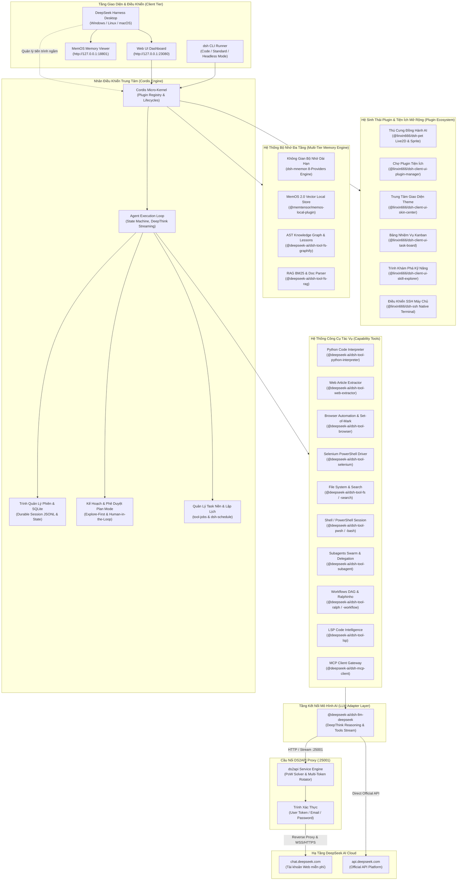

# DeepSeek Harness v1.0.3 (Bản Tiếng Việt & Cầu Nối DS2API)

Tiếng Việt | [English](README.en.md) | [中文](README.zh.md)

**DeepSeek Harness (`dsh`)** là nền tảng Autonomous AI Agent thế hệ mới mã nguồn mở, được xây dựng dựa trên kiến trúc vi nhân (Micro-kernel) của **Cordis** với triết lý thiết kế cốt lõi: **"Mọi thứ đều là Plugin" (Everything is a Plugin)**.

Phiên bản **v1.0.3** là bản cập nhật đột phá toàn diện, biến DeepSeek thành một Siêu Trợ Lý AI (Super Agent) tích hợp đầy đủ khả năng: **Hệ sinh thái Plugin đa năng (Chợ Plugin, Thú cưng AI Desktop Pet, Task Board Kanban, Skin Center, Skill Explorer, SSH Client), Hệ thống Bộ nhớ đa tầng (Memory Spaces 8-Providers + MemOS 2.0 + AST Knowledge Graph + RAG BM25), Chuỗi suy luận sâu DeepThink (CoT stream), Trình thông dịch Python Code Interpreter, Bóc tách nội dung Web ngữ nghĩa, Tự động hóa trình duyệt với cơ chế thị giác Set-of-Mark, Điều khiển Selenium PowerShell native, Điều phối Multi-Agent/Subagents, Lập kế hoạch Plan Mode, Quy trình Workflows DAG, Cầu nối DS2API tự động 100% kèm Ứng dụng Desktop Native Đa Nền Tảng (Windows, Linux, macOS)**.

---

## Bản Quyền & Giấy Phép

Copyright (c) 2024-2026 Nguyễn Quang Tú (QTusdev) - [https://github.com/qtu11/DeepSeek-Harness-Ds2api](https://github.com/qtu11/DeepSeek-Harness-Ds2api)

Nguyễn Quang Tú biên dịch và phát triển mở rộng.

Dự án được phân phối theo giấy phép [MIT](LICENSE). Thông báo bản quyền của các thành phần bên thứ ba được ghi nhận tại [THIRD_PARTY_NOTICES.md](THIRD_PARTY_NOTICES.md).

---

## 1. Sơ Đồ Kiến Trúc Hệ Thống (System Architecture v1.0.3)



---

## 2. Hệ Thống Plugin & Tiện Ích Mở Rộng Độc Quyền (Plugin Ecosystem)

DeepSeek Harness sở hữu hệ sinh thái plugin giao diện người dùng và tiện ích mở rộng phong phú, được Việt hóa 100% chuẩn ngữ nghĩa:

### 2.1. Thú Cưng Đồng Hành AI (Desktop Pet - `@linxin666/dsh-pet`)
- **Linh vật trợ lý tương tác trực tiếp**: Hiển thị nhân vật anime/cá voi sống động ngay trên giao diện làm việc.
- **Hỗ trợ đa chế độ hoạt họa**: Kết xuất mượt mà qua cả **Sprite Animation Atlas** (chuẩn 192x208 / 8 cột chống xé hình) và **Live2D Cubism Core**.
- **Tương tác đa dạng**:
  - *Cho ăn (Feed)*: Nhận cá khô khi hoàn thành nhiệm vụ lập trình, tăng điểm thân thiết.
  - *Xoa đầu & Vuốt ve*: Phản hồi cảm xúc ngộ nghĩnh, lời thoại ấm áp.
  - *Đổi tên & Cá nhân hóa*: Tự do đặt tên riêng cho thú cưng.
  - *Bong bóng trạng thái (Status Bubble)*: Thông báo tiến trình suy nghĩ của AI, nhắc nhở nghỉ ngơi khi làm việc lâu.
  - *Cấp độ thân thiết*: Từ *Cá voi con*, *Bạn đồng hành*, *Bạn thân thiết*, *Tri kỷ ăn ý*, đến *Bạn tâm giao*.

### 2.2. Chợ Plugin & Quản Lý Tiện Ích (`@linxin666/dsh-client-ui-plugin-manager`)
- Tìm kiếm, cài đặt, bật/tắt và cập nhật các plugin cộng đồng chỉ với 1 cú click.
- Tự động kiểm tra tính tương thích phiên bản vi nhân Cordis và nạp động (hot-reload) không cần khởi động lại.

### 2.3. Bảng Quản Lý Nhiệm Vụ Kanban (`@linxin666/dsh-client-ui-task-board`)
- Trực quan hóa tiến độ công việc của Agent theo chuẩn Kanban (Cần làm, Đang thực hiện, Chờ duyệt, Hoàn thành).
- Phân chia nhiệm vụ con tự động từ kế hoạch Plan Mode sang các thẻ Task độc lập.

### 2.4. Trung Tâm Giao Diện & Theme Kính Mờ (`@linxin666/dsh-client-ui-skin-center`)
- Bộ sưu tập chủ đề hiện đại: Dark Studio, Cyberpunk Glass, Clean Light, Oceanic Blue.
- Tùy chỉnh độ mờ Acrylic/Glassmorphism, màu sắc thanh bên và hình nền không gian làm việc.

### 2.5. Trình Khám Phá Kỹ Năng (Skill Explorer - `@linxin666/dsh-client-ui-skill-explorer`)
- Tra cứu và kích hoạt hơn 100+ Skills nghiệp vụ chuyên sâu (Database Design, Frontend Aesthetics, DevOps Pipeline, Security Pentest, Algorithm Optimization).

### 2.6. Quản Lý Phiên SSH Native (`@linxin666/dsh-ssh`)
- Kết nối và quản lý terminal máy chủ từ xa an toàn trực tiếp từ bảng điều khiển của DeepSeek Harness.

---

## 3. Hệ Thống Bộ Nhớ Đa Tầng (Advanced Multi-Tier Memory)

DeepSeek Harness trang bị kiến trúc bộ nhớ 4 tầng mạnh mẽ, giải quyết triệt để vấn đề quên ngữ cảnh của các mô hình ngôn ngữ lớn:

### 3.1. Không Gian Bộ Nhớ Dài Hạn (Memory Spaces - `dsh-mnemon`)
- **Quản lý không gian tri thức độc lập**: Phân tách dữ liệu tri thức theo từng dự án hoặc từng domain nghiệp vụ riêng biệt.
- **Tích hợp sẵn 8 Nhà cung cấp bộ nhớ (Memory Providers)**:
  1. **Mnemon Native Store**: Bộ nhớ cục bộ tốc độ cao với SQLite & JSON persistence, hỗ trợ lệnh `remember`, `recall`, `forget`, `viz`.
  2. **OpenViking**: Bộ nhớ ngữ nghĩa hướng API kết nối đám mây.
  3. **Honcho**: Quản lý bối cảnh người dùng và lược sử hội thoại đa chiều.
  4. **Mem0**: Bộ nhớ cá nhân hóa thích ứng thông minh.
  5. **Hindsight**: Tự động phản tư và tái sử dụng kinh nghiệm xử lý lỗi trong quá khứ.
  6. **Holographic**: Lưu trữ và ánh xạ sự kiện tri thức cấu trúc đa chiều.
  7. **RetainDB**: Cơ sở dữ liệu tri thức bền vững cho doanh nghiệp.
  8. **ByteRover / Supermemory**: Quản lý bộ nhớ thư mục mã nguồn và siêu dữ liệu phiên.
- **Trực quan hóa đồ thị tri thức (`viz`)**: Xuất biểu đồ tương tác HTML thể hiện mối quan hệ giữa các insight.

### 3.2. MemOS 2.0 Local Engine (`@memtensor/memos-local-plugin`)
- Lưu trữ bộ nhớ dài hạn L1/L2/L3 cục bộ với cơ chế tìm kiếm vector nhúng.
- Quản lý qua giao diện **MemOS Memory Viewer** tại cổng `http://127.0.0.1:18801`.

### 3.3. Đồ Thị Tri Thức Codebase & Bộ Nhớ Bài Học (`@deepseek-ai/dsh-tool-fs-graphify`)
- **AST Knowledge Graph (`graphify_scan`, `graphify_query`)**: Quét toàn bộ codebase (TypeScript, Python, Go, Rust, C#, SQL), trích xuất hơn 29,000+ nodes và 46,000+ edges, phát hiện các trung tâm kiến trúc (**God Nodes**) và tự động sinh `GRAPH_REPORT.md`.
- **Work Memory & Reflection (`graphify_save_result`, `graphify_reflect`)**: Tự động lưu vết kết quả và tín hiệu kinh nghiệm (`useful`, `dead_end`, `corrected`) sau các tác vụ, chạy thuật toán tính điểm suy giảm theo thời gian sinh ra `LESSONS.md`. Tự động nạp vào System Prompt giúp AI luôn nắm chắc kiến trúc dự án.

### 3.4. RAG BM25 & Document Intelligence (`@deepseek-ai/dsh-tool-fs-rag`)
- Tìm kiếm ngữ nghĩa tài liệu và mã nguồn theo thuật toán xếp hạng BM25 (Robertson-Spärck Jones IDF), phân đoạn tài liệu lớn chính xác mà không gây tràn Context Window.

---

## 4. Các Năng Lực Cốt Lõi Khác Trong v1.0.3

- **Chuỗi Suy Luận Sâu DeepThink (Reasoning / CoT Streaming)**: Bóc tách luồng `reasoning_content` delta thành khối tư duy độc lập; hỗ trợ 4 mức điều chỉnh (`off`, `low`, `high`, `max`).
- **Python Code Interpreter (`@deepseek-ai/dsh-tool-python-interpreter`)**: Thực thi mã Python cục bộ, phân tích dữ liệu, tính toán khoa học với `numpy`/`pandas` và xuất biểu đồ hình ảnh.
- **Bóc Tách Nội Dung Web (`@deepseek-ai/dsh-tool-web-extractor`)**: Tải URL và chuyển đổi nội dung bài viết sạch sang Markdown, loại bỏ quảng cáo và mã rác.
- **Tự Động Hóa Trình Duyệt & Set-of-Mark (`@deepseek-ai/dsh-tool-browser`)**: Điều khiển Chromium/Chrome/Edge qua Playwright, tự động đánh số thẻ trực quan `[1]`, `[2]`, `[3]` hỗ trợ Vision AI thao tác chuẩn xác.
- **Điều Khiển Selenium Native (`@deepseek-ai/dsh-tool-selenium`)**: Tự động hóa trình duyệt qua module Selenium PowerShell Windows native.
- **Quản Lý Task Nền & DAG Workflows (`tool-jobs`, `tool-workflow`)**: Chạy ngầm tiến trình dài hạn, lập lịch định kỳ và điều phối đa tác nhân song song.
- **Chế Độ Plan Mode (Explore-First)**: Buộc Agent khảo sát kỹ lưỡng codebase trước khi lập kế hoạch hành động và chờ người dùng duyệt.
- **Cầu Nối DS2API Tự Động 100%**: Biến tài khoản web DeepSeek miễn phí thành endpoint chuẩn OpenAI API có hỗ trợ giải Proof-of-Work (PoW) tốc độ cao bằng Go.

---

## 5. Bảng Thông Số Cổng Mạng (Network Configuration)

| Thành Phần | Cổng Mặc Định | Địa Chỉ Truy Cập | Mục Đích Sử Dụng |
| :--- | :---: | :--- | :--- |
| **Web UI Dashboard** | `23080` | `http://127.0.0.1:23080` | Giao diện điều khiển và tương tác Agent chính |
| **MemOS Memory Viewer** | `18801` | `http://127.0.0.1:18801` | Bảng điều khiển quản lý và tra cứu bộ nhớ dài hạn |
| **DS2API Proxy Bridge** | `25001` | `http://127.0.0.1:25001/v1` | Cầu nối API tương thích OpenAI cho DeepSeek |
| **RPC Gateway (Typert)** | Động / Nội bộ | `IPC / Loopback` | Giao tiếp kiểu hình an toàn giữa Host và Client |

---

## 6. Cấu Hình Biến Môi Trường (`.env`)

Tạo hoặc chỉnh sửa tệp `.env` tại thư mục gốc của dự án:

```env
# ==============================================================================
# CẤU HÌNH KẾT NỐI DEEPSEEK HARNESS v1.0.3
# ==============================================================================

# Cổng Web UI (Mặc định: 23080)
PORT=23080

# ------------------------------------------------------------------------------
# LỰA CHỌN A: SỬ DỤNG TÀI KHOẢN WEB DEEPSEEK MIỄN PHÍ (QUA DS2API)
# ------------------------------------------------------------------------------
DS2API_ENABLED=true
DS2API_PORT=25001

# Cách 1: Sử dụng User Token lấy từ chat.deepseek.com (Khuyên dùng)
# (Đăng nhập chat.deepseek.com -> F12 -> Application -> Local Storage -> userToken)
DS_USER_TOKEN=your_user_token_here

# Hoặc Cách 2: Đăng nhập bằng Email và Mật khẩu
# DS_EMAIL=your_email@example.com
# DS_PASSWORD=your_password_here

# ------------------------------------------------------------------------------
# LỰA CHỌN B: SỬ DỤNG OFFICIAL API KEY (NỀN TẢNG TRẢ PHÍ DEEPSEEK)
# ------------------------------------------------------------------------------
# DEEPSEEK_API_KEY=sk-your-official-deepseek-api-key
# DEEPSEEK_BASE_URL=https://api.deepseek.com
```

---

## 7. Hướng Dẫn Khởi Chạy & Đóng Gói Ứng Dụng Desktop

### 7.1. Khởi Chạy Ứng Dụng Desktop

#### Trên Windows:
- Nhấp đúp vào tệp `DeepSeek Harness.exe` hoặc chạy từ `dist-app/DeepSeek Harness-win32-x64/DeepSeek Harness.exe`.
- Ứng dụng tự động khởi chạy backend và mở giao diện Web tại `http://127.0.0.1:23080`.

#### Trên Linux:
- Chạy thực thi: `./dist-app/DeepSeek\ Harness-linux-x64/deepseek-harness`

#### Trên macOS:
- Mở ứng dụng từ thư mục `dist-app/DeepSeek Harness-darwin-x64/DeepSeek Harness.app` hoặc `dist-app/DeepSeek Harness-darwin-arm64/DeepSeek Harness.app`.

---

### 7.2. Hướng Dẫn Đóng Gói Desktop App (Build Desktop Across OS)

DeepSeek Harness cung cấp công cụ tự động đóng gói ứng dụng Desktop sang cả 3 hệ điều hành phổ biến:

```powershell
# Chạy script đóng gói tự động toàn bộ nền tảng
pnpm run build:desktop
```

#### Cấu trúc thư mục đầu ra trong `dist-app/`:
- **Windows (x64)**: `dist-app/DeepSeek Harness-win32-x64/` (kèm file thực thi `DeepSeek Harness.exe` đã nạp biểu tượng PE Icon).
- **Linux (x64)**: `dist-app/DeepSeek Harness-linux-x64/` (dành cho Ubuntu, Debian, Fedora, Arch Linux).
- **Linux (ARM64)**: `dist-app/DeepSeek Harness-linux-arm64/` (dành cho Raspberry Pi 4/5, server ARM64).
- **macOS (Intel & Apple Silicon)**: `dist-app/DeepSeek Harness-darwin-x64/` và `dist-app/DeepSeek Harness-darwin-arm64/`.

---

### 7.3. Khởi Chạy Bằng Dòng Lệnh (CLI / Web Mode)

Yêu cầu Node.js >= 22.19 và pnpm >= 11.

```powershell
# 1. Cài đặt các gói phụ thuộc (chỉ chạy lần đầu)
pnpm install

# 2. Khởi chạy Web UI Dashboard
pnpm dsh web

# Hoặc chỉ định cổng tùy chọn
pnpm dsh web --port 23080
```

---

### 7.4. Chạy Agent Trực Tiếp Trong Terminal (Interactive CLI / Headless)

```powershell
# Chạy tương tác với Profile lập trình chuyên sâu đầy đủ công cụ (Code Preset)
pnpm dsh --profile code

# Chạy tương tác với Profile đa năng hàng ngày (Standard Preset)
pnpm dsh --profile standard

# Chạy một tác vụ tự động duy nhất (Headless Task)
pnpm dsh --profile headless "Phân tích cấu trúc thư mục packages/ và viết báo cáo tóm tắt"
```

---

## 8. Bảng Tổng Hợp Công Cụ Model-Facing Trong v1.0.3

| Tên Công Cụ | Package Sở Hữu | Mô Tả Chức Năng |
| :--- | :--- | :--- |
| **`python_execute`** | `@deepseek-ai/dsh-tool-python-interpreter` | Thực thi mã Python, phân tích dữ liệu và tính toán thuật toán |
| **`rag_search`** | `@deepseek-ai/dsh-tool-fs-rag` | Tìm kiếm ngữ nghĩa tài liệu và mã nguồn theo thuật toán BM25 |
| **`doc_parse`** | `@deepseek-ai/dsh-tool-fs-rag` | Phân tích cấu trúc tài liệu lớn thành các phần đoạn có chỉ mục |
| **`graphify_scan`** | `@deepseek-ai/dsh-tool-fs-graphify` | Quét AST toàn bộ codebase, xây dựng đồ thị tri thức và xuất `GRAPH_REPORT.md` |
| **`graphify_query`** | `@deepseek-ai/dsh-tool-fs-graphify` | Truy vấn nút lân cận, chu trình phụ thuộc và đường dẫn kiến trúc trên đồ thị |
| **`graphify_save_result`** | `@deepseek-ai/dsh-tool-fs-graphify` | Lưu vết kết quả Q&A và tín hiệu outcome (useful/dead_end/corrected) vào Work Memory |
| **`graphify_reflect`** | `@deepseek-ai/dsh-tool-fs-graphify` | Phản tư tất định tổng hợp bài học theo thời gian sinh ra `LESSONS.md` |
| **`web_extract`** | `@deepseek-ai/dsh-tool-web-extractor` | Tải và trích xuất nội dung bài viết web sạch dạng Markdown |
| **`browser_navigate`** | `@deepseek-ai/dsh-tool-browser` | Mở trình duyệt Chrome/Edge và điều hướng tới trang web |
| **`browser_click`** | `@deepseek-ai/dsh-tool-browser` | Nhấn vào phần tử theo selector, văn bản hiển thị hoặc tọa độ |
| **`browser_type`** | `@deepseek-ai/dsh-tool-browser` | Nhập văn bản vào trường form hoặc textarea trên trang web |
| **`browser_screenshot`** | `@deepseek-ai/dsh-tool-browser` | Chụp ảnh màn hình (hỗ trợ tùy chọn gắn thẻ Set-of-Mark) |
| **`browser_highlight`** | `@deepseek-ai/dsh-tool-browser` | Quét và trả về danh sách chi tiết các phần tử tương tác trên trang |
| **`browser_eval`** | `@deepseek-ai/dsh-tool-browser` | Thực thi mã JavaScript trực tiếp trong ngữ cảnh trang web |
| **`selenium_execute`** | `@deepseek-ai/dsh-tool-selenium` | Điều khiển trình duyệt native qua lệnh Selenium PowerShell |
| **`fs_read` / `fs_write`** | `@deepseek-ai/dsh-tool-fs` | Đọc, ghi và quản lý hệ thống tệp tin trong workspace |
| **`str_replace_editor`** | `@deepseek-ai/dsh-tool-str-replace-editor` | Thay thế các khối nội dung chính xác trong tệp tin |
| **`glob` / `grep`** | `@deepseek-ai/dsh-tool-fs-search` | Tìm kiếm tệp tin và tìm kiếm mẫu regex qua ripgrep nhúng |
| **`subagent`** | `@deepseek-ai/dsh-tool-subagent` | Ủy quyền tác vụ cho agent con chạy độc lập |
| **`subagent_fork`** | `@deepseek-ai/dsh-tool-subagent` | Phân nhánh phiên làm việc hiện tại để thử nghiệm giải pháp |
| **`tool-jobs`** | `@deepseek-ai/dsh-tool-jobs` | Quản lý tiến trình nền (`run_in_background`, `kill`, `stdin`) |
| **`todo_write`** | `@deepseek-ai/dsh-tool-todo` | Ghi nhận và theo dõi danh sách công việc đa bước |
| **`exit_plan_mode`** | `@deepseek-ai/dsh-plan-mode` | Trình kế hoạch hoàn chỉnh để người dùng phê duyệt |

---

## 9. Cấu Trúc Thư Mục Dự Án (Repository Structure)

```
DeepSeek-Harness-Ds2api/
├── DeepSeek Harness.exe                  # Ứng dụng Desktop Windows 1-Click
├── .env                                  # File cấu hình biến môi trường & khóa xác thực
├── package.json                          # Quản lý kịch bản npm và cấu hình Monorepo
├── pnpm-workspace.yaml                   # Khai báo không gian làm việc Monorepo
│
├── apps/                                 # Các ứng dụng đầu cuối
│   ├── cli/                              # Bộ điều khiển dòng lệnh dsh CLI & Presets
│   └── desktop/                          # Cấu hình Electron wrapper cho Desktop App
│
├── dist-app/                             # Các gói ứng dụng Desktop đã biên dịch
│   ├── DeepSeek Harness-win32-x64/       # Bản phân phối Windows x64
│   ├── DeepSeek Harness-linux-x64/       # Bản phân phối Linux x64
│   └── DeepSeek Harness-linux-arm64/     # Bản phân phối Linux ARM64
│
├── packages/                             # Hệ sinh thái các thư viện lõi (Plugin Packages)
│   ├── code-runtime/
│   │   └── tool-python-interpreter/      # Plugin Python Code Interpreter
│   ├── fs/
│   │   ├── tool-fs-rag/                  # Plugin RAG BM25 & Document Intelligence
│   │   ├── tool-fs/                      # Plugin thao tác hệ thống tệp tin
│   │   └── tool-fs-search/               # Plugin tìm kiếm ripgrep nhúng
│   ├── web/
│   │   ├── tool-browser/                 # Plugin tự động hóa trình duyệt & Set-of-Mark
│   │   ├── tool-web-extractor/           # Plugin bóc tách bài viết web sạch
│   │   ├── tool-selenium/                # Plugin điều khiển Selenium PowerShell
│   │   └── tool-web/                     # Plugin tìm kiếm web Exa/Perplexity/DeepSeek
│   ├── core/                             # Vòng lặp Agent Loop, Session, Tool Registry
│   ├── client/                           # 24 gói giao diện Web UI (Đã Việt hóa 100%)
│   ├── llm/                              # Adapter kết nối mô hình DeepSeek & DeepThink
│   ├── subagent/                         # Plugin phân quyền và điều phối Multi-Agent
│   ├── workflow/                         # Plugin điều phối quy trình DAG & Ralphinho
│   ├── plan/                             # Plugin lập kế hoạch và quản lý trạng thái
│   ├── todo/                             # Plugin quản lý danh sách đầu việc
│   ├── session/                          # Plugin lưu trữ phiên JSONL & SQLite
│   └── compaction/                       # Plugin nén ngữ cảnh tự động
│
├── tools/                                # Các công cụ hỗ trợ mở rộng
│   ├── bin/                              # File thực thi tiện ích (mnemon CLI wrapper, etc.)
│   ├── ds2api/                           # Mã nguồn Go & binary ds2api.exe (Web to API Bridge)
│   ├── launcher/                         # Mã nguồn Go & kịch bản build Electron Desktop
│   ├── memos/                            # Hệ thống bộ nhớ dài hạn MemOS 2.0
│   ├── qwen-agent/                       # Kho thuật toán và công cụ tham chiếu Qwen-Agent
│   └── selenium-powershell/              # Module Selenium PowerShell cho Windows
│
├── docs/                                 # Tài liệu kỹ thuật kiến trúc chi tiết
└── website/                              # Mã nguồn trang tài liệu VitePress
```

---

## 10. Lệnh Phát Triển & Kiểm Thử Dành Cho Lập Trình Viên

| Lệnh Thực Thi | Mô Tả Chức Năng |
| :--- | :--- |
| `pnpm install` | Cài đặt toàn bộ dependencies cho tất cả packages |
| `pnpm run build` | Biên dịch toàn bộ thư viện TypeScript và Web UI |
| `pnpm run build:desktop` | Đóng gói ứng dụng Desktop đa nền tảng (Windows, Linux, macOS) |
| `pnpm run test` | Chạy bộ kiểm thử đơn vị (Unit Tests với Vitest) |
| `pnpm run test:coverage` | Kiểm tra tỷ lệ bao phủ mã nguồn (Coverage Gate 100%) |
| `pnpm run test:e2e` | Chạy kiểm thử tích hợp thực tế với API |
| `pnpm run typecheck` | Kiểm tra tính nhất quán kiểu dữ liệu TypeScript toàn bộ Monorepo |
| `pnpm run lint` | Rà quét lỗi phong cách viết mã với Oxlint |
| `pnpm run clean` | Dọn dẹp các tệp build tạm và artifact thừa |

---
## 10. Cách tải app 
vào "Releases" => bấm chọn tag v1.0.3 => tải bản phù hợp với hệ điều hành


## 11. Thông Tin Liên Hệ & Tác Quyền

- **Tác giả & Đơn vị phát triển**: Nguyễn Quang Tú (QTusdev)
- **Repository chính thức**: [https://github.com/qtu11/DeepSeek-Harness-Ds2api](https://github.com/qtu11/DeepSeek-Harness-Ds2api)
- **Tài liệu tham khảo**: Thư mục [docs/](docs/)
